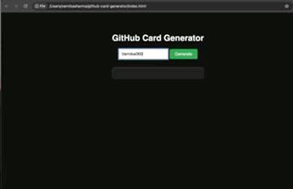

# 📇 GitHub Card Generator
A stylish GitHub profile card generator with PNG download and theme toggles.
<p align="center">
  
</p>

## ✨ About the Project

The GitHub Card Generator is a stylish and interactive tool to generate a shareable GitHub profile card.  
It includes:
- Light/Dark mode toggle
- PNG download support
- A live preview of your GitHub data

Ideal for use in portfolios, resumes, or GitHub READMEs.
## 🛠 Tech Stack

- HTML
- CSS
- JavaScript

 
 ## 🚀 How to Use

Follow these simple steps to use the GitHub Card Generator:

1. **Clone the repository**

   ```bash
   git clone https://github.com/Varnika060306/github-card-generator.git
   ```

2. **Navigate into the project folder**

   ```bash
   cd github-card-generator
   ```

3. **Open the app in your browser**

   - Double-click on `index.html`
     **OR**
   - Use the command below to open it from the terminal (macOS):
   
   ```bash
   open index.html
   ```

4. **Use the tool**

   - Enter your GitHub username
   - Click the **Generate** button
   - Use the **Theme Toggle** button to switch between light and dark mode
   - Click **Download PNG** to save your profile card

That’s it.Your stylish GitHub card is ready 🎉

## ✨ Features

- 🎨 Toggle between **light** and **dark** themes
- 👤 Generate a stylish GitHub profile card
- 🖼️ Download the card as a **PNG image**
- 🧠 Built with clean, readable vanilla JavaScript
- ⚡ No external dependencies or frameworks

## 📁 Folder Structure

```
github-card-generator/
├── index.html        # Main HTML file
├── style.css         # Styling for the card and UI
├── script.js         # Logic for card generation, toggles, and download
├── demo.gif          # Demo GIF showing the tool in action
└── README.md         # Project documentation
```
## 🙌 Credits

This mini project was created as part of my open-source learning journey.  
Inspired by GitHub profile card designs and built to practice vanilla web dev ✨

- Designed & Developed by [@Varnika060306](https://github.com/Varnika060306)
